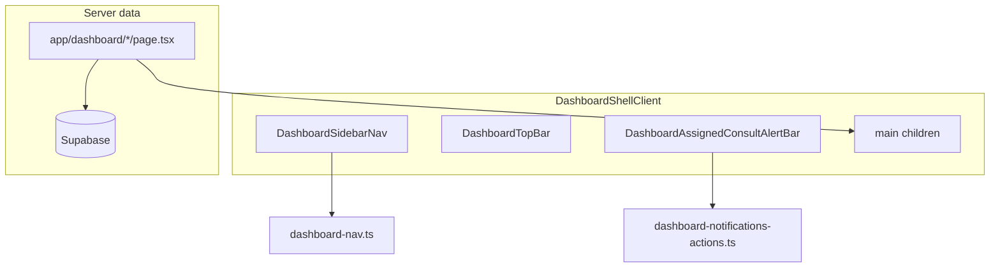

# VetFlow / ClinixDev Dashboard Fixes Plan

> **Deliverable:** On approval, write this plan to [`docs/vetflow-dashboard-fixes-plan.md`](docs/vetflow-dashboard-fixes-plan.md) (folder does not exist yet).

---

## 1. Codebase Audit Summary

VetFlow is a **Next.js App Router** app with **Supabase** backend, **Tailwind** + custom `glass-panel` / `dashboard-card` design tokens, and role-based access via [`lib/auth/capabilities.ts`](lib/auth/capabilities.ts).

### Route / layout structure

| Layer | Key files |
|-------|-----------|
| App shell | [`components/layout/DashboardShellClient.tsx`](components/layout/DashboardShellClient.tsx) — sidebar, top bar, alert bars, main content |
| Navigation config | [`lib/navigation/dashboard-nav.ts`](lib/navigation/dashboard-nav.ts) — static groups, `filterNavGroups()`, `isNavItemActive()` |
| Nav link behavior | [`components/layout/DashboardNavLink.tsx`](components/layout/DashboardNavLink.tsx) — **pathname-only** same-route guard |
| Dashboard home | [`app/dashboard/page.tsx`](app/dashboard/page.tsx) — role-specific server queries; admin uses [`loadAdminOverviewBundle()`](lib/dashboard/admin-overview.ts) |
| Consultation | [`app/dashboard/doctors/[visitId]/page.tsx`](app/dashboard/doctors/[visitId]/page.tsx) → [`ConsultationWorkspaceClient.tsx`](components/forms/ConsultationWorkspaceClient.tsx) — SOAP **or** [`AppointmentWorkflowRenderer`](components/consultations/workflows/AppointmentWorkflowRenderer.tsx) |
| Workflow configs | [`lib/consultations/workflow-config.ts`](lib/consultations/workflow-config.ts) — vaccination has **10 horizontal step tabs** |
| Schedule | [`app/dashboard/schedule/page.tsx`](app/dashboard/schedule/page.tsx) → [`ScheduleDayCalendarClient.tsx`](components/schedule/ScheduleDayCalendarClient.tsx) |
| Inventory | [`app/dashboard/inventory/page.tsx`](app/dashboard/inventory/page.tsx) — `?tab=intake` switches catalog vs stock intake |
| Checkout | [`app/dashboard/invoices/create/[visitId]/page.tsx`](app/dashboard/invoices/create/[visitId]/page.tsx) → [`InvoiceCheckoutClient.tsx`](components/forms/InvoiceCheckoutClient.tsx) |
| Pet medical file | [`PetMedicalProfileClient.tsx`](components/pets/PetMedicalProfileClient.tsx) + [`PatientHealthGraph.tsx`](components/pets/PatientHealthGraph.tsx) |
| Modals | **Split:** [`components/ui/premium/Modal.tsx`](components/ui/premium/Modal.tsx) (portal, a11y) vs inline overlays in [`CustomerForm.tsx`](components/forms/CustomerForm.tsx) / [`PetForm.tsx`](components/forms/PetForm.tsx) |
| PDF pattern | `@react-pdf/renderer` in [`components/pdf/*`](components/pdf/) + `app/api/**/route.ts` |

### Architecture diagram



---

## 2. Screenshot-Based Findings

| Screenshot | Page / route | Component | Issue observed |
|------------|--------------|-----------|----------------|
| Edit Customer | `/dashboard/customers` | `CustomerForm` inline modal | Title/button alignment; not using shared `Modal` |
| Edit Pet | `/dashboard/pets` | `PetForm` inline modal | Same; labels/buttons misaligned vs customer modal |
| Schedule day view | `/dashboard/schedule` | `ScheduleDayCalendarClient` | Appointment blocks span multiple 15-min rows; may block slots |
| Vaccination workflow | `/dashboard/doctors/[visitId]` | `AppointmentWorkflowRenderer` | 10 step tabs (screenshot shows 6 visible + scroll); too dense |
| Inventory list | `/dashboard/inventory` | `InventoryCatalogClient` | "Service" + "ORG SERVICE" / "Catalog" duplicate badges |
| Appointments | `/dashboard/appointments` | `page.tsx` + `AppointmentsListClient` | `DateRangeQuickFilter` rendered **twice** |
| Stock intake nav | `/dashboard/inventory?tab=intake` | `DashboardNavLink` + inventory page | Sidebar highlights Stock intake but content may stay on Catalog |
| Admin dashboard KPIs | `/dashboard` (clinic_admin) | `ClinicAdminDashboardClient` | Cards show 0 / -100% trends; may be real or stale/timezone |
| Pet medical file | `/dashboard/pets/[id]` | `PetMedicalProfileClient` | No print/PDF; only "Back to owner profile" |
| Health timeline chart | Pet medical file tab | `PatientHealthGraph` | X-axis "Jun 26, 26" duplicate labels; 2-digit year |
| Sidebar | All dashboards | `DashboardShellClient` | Long nav; scroll may move main page |
| Checkout | `/dashboard/invoices/create/[visitId]` | `InvoiceCheckoutClient` | Manual line items; Zod enum error for product types |
| Checkout error | Same | `CheckoutLineItemSchema` | `Invalid option: service|product|medicine` on lineItems[3] |
| Consultation SOAP | `/dashboard/doctors/[visitId]` | `ConsultationWorkspaceClient` | Pause visible in SOAP branch |
| Consultation vaccination | Same | Workflow branch | **No Pause button** in workflow branch |
| Blue assigned bar | Consultation room | `DashboardAssignedConsultAlertBar` | Still shows while visit status is `consulting` |

---

## 3. Issue-by-Issue Root Cause + Fix Plan

### Task 1 — Customer edit popup alignment

**Problem:** Edit Customer modal looks misaligned (title offset, inconsistent spacing).

**Likely files:** [`components/forms/CustomerForm.tsx`](components/forms/CustomerForm.tsx), audit: `StaffForm`, `BranchForm`, `PrescriptionEditModal`, `NewAppointmentWizard`.

**Root cause:** Custom `fixed inset-0 z-50` overlay (no portal, no `pr-8` on title for close button, `z-50` vs premium `z-[100]`). Inconsistent label/footer patterns across forms.

**Proposed fix:**
- Create [`components/ui/premium/FormModal.tsx`](components/ui/premium/FormModal.tsx) wrapping existing [`Modal.tsx`](components/ui/premium/Modal.tsx) with standard: title, optional description, scrollable body (`max-h-[85vh]`), footer row (`Cancel` + primary action right-aligned).
- Migrate `CustomerForm` edit/create overlay to `FormModal`.
- Audit checklist: centered, `max-w-md`, `grid-cols-2` gaps, footer `flex justify-end gap-2`.

**Acceptance criteria:** Customer edit modal centered; title left-aligned with padding for X; buttons aligned; Escape/backdrop close works.

**After fix UX:** All customer modals match inventory `ProductEditModal` quality.

---

### Task 2 — Pet edit popup alignment

**Problem:** Edit Pet modal inconsistent with customer modal (screenshot: title right-heavy, buttons spread).

**Likely files:** [`components/forms/PetForm.tsx`](components/forms/PetForm.tsx).

**Root cause:** Duplicate overlay markup; missing subtitle; shorter label classes; footer uses `justify-between` (Cancel far left, Save far right).

**Proposed fix:** Migrate `PetForm` to shared `FormModal`; unify label classes with customer form; use `max-w-md` + scroll for long forms.

**Acceptance criteria:** Pet and customer modals visually identical in structure.

---

### Task 3 — Calendar appointment block spans wrong rows

**Problem:** New appointments visually occupy ~3 time boxes; other slots should remain clickable.

**Likely files:** [`components/schedule/ScheduleDayCalendarClient.tsx`](components/schedule/ScheduleDayCalendarClient.tsx), [`app/dashboard/schedule/page.tsx`](app/dashboard/schedule/page.tsx), [`lib/appointments/slot-conflict.ts`](lib/appointments/slot-conflict.ts).

**Root cause to verify:**
1. `duration_minutes` in DB (3 slots = **45 min** per `appointmentLayout()` math).
2. Misread of `"3 appts"` overlap label as 3 slots.
3. Absolute blocks at `z-[2]` may cover slot buttons if height is wrong.
4. `DashboardNavLink`-style issues do **not** apply here.

**Proposed fix:**
- Add dev logging or admin tooltip showing `durationMinutes` on block hover.
- Normalize page mapping: `(duration_minutes ?? 30) || 30` to treat `0` as 30.
- Ensure slot buttons stay clickable: appointment blocks `pointer-events-none` on container, `pointer-events-auto` on block body only; or reduce block height to not extend past computed end.
- Add duration selector to [`NewAppointmentWizard.tsx`](components/reception/NewAppointmentWizard.tsx) (15/30/45/60) and persist to `appointments.duration_minutes`.
- Align `isSlotBlockedForDoctor` with actual selected duration.

**Acceptance criteria:** 30-min appointment spans 2 rows; empty slots below remain clickable; duration shown in block label.

---

### Task 4 — Vaccination workflow too detailed

**Problem:** 10 horizontal step tabs in [`vaccinationWorkflowConfig`](lib/consultations/workflow-config.ts); impractical for clinic use.

**Likely files:** `workflow-config.ts`, `VaccinationWorkflow.tsx`, `AppointmentWorkflowRenderer.tsx`, `workflow-validation.ts`, `workflow-to-soap.ts`.

**Root cause:** Full spec implementation with 10 steps + 12 process sub-steps.

**Proposed fix (2-page workflow):**

| Page | Merged sections | Keep fields |
|------|-----------------|-------------|
| **1 — Clinical** | Arrival, screening, exam, vaccine plan, administration, not-fit branch | Owner/pet confirm, fitness, vaccine rows (name/lot/route/admin/by/next due), process checklist (collapsed to 4 items: verify, administer, observe, record) |
| **2 — Wrap-up** | Documentation, owner comms, checkout summary, follow-up | Certificate upload, notes, notification channel preference, services, next due |

- Reduce `vaccinationWorkflowConfig.steps` from 10 → 2 (or 3 max).
- Merge section state in `workflow-types.ts` (keep JSON shape backward-compatible via migration mapper reading old drafts).
- Replace horizontal 10-tab bar with **2 large step cards** or vertical stepper (same pattern for deworming/grooming optional phase 2).
- Update `workflow-validation.ts` minimum fields unchanged.

**Acceptance criteria:** Vaccination consult fits in ≤2 screens without horizontal tab scroll; completion validation still passes; SOAP mapping unchanged in output.

---

### Task 5 — Pet medical file Print/PDF

**Problem:** No export from medical file page.

**Likely files:** [`PetMedicalProfileClient.tsx`](components/pets/PetMedicalProfileClient.tsx), [`lib/services/patient-medical-actions.ts`](lib/services/patient-medical-actions.ts), new PDF + API route.

**Root cause:** Feature not built; existing PDF infra covers invoice, prescription, treatment, vaccination certificate only.

**Proposed fix:**
- Add [`components/pdf/PetMedicalFilePdfDocument.tsx`](components/pdf/PetMedicalFilePdfDocument.tsx) using `@react-pdf/renderer` + [`PdfClinicHeader.tsx`](components/pdf/PdfClinicHeader.tsx).
- Add `GET app/api/pets/[petId]/medical-file/route.ts` — server loads profile via existing loader, renders PDF stream.
- Add **Print / Export PDF** button in `PetMedicalProfileClient` header (page variant only); opens API in new tab.
- Sections: pet profile, owner, medical history summary, health metrics table, vaccination/deworming/grooming chart rows from `workflow_payload`, lab docs list, billing summary (invoice totals), visit case history.
- Charts: embed **metric table snapshot** (not live Recharts); optional small sparkline as static values.

**Acceptance criteria:** PDF downloads with real Supabase data, clinic logo/name, all major sections; does not break interactive page.

---

### Task 6 — Global back navigation

**Problem:** Inner pages lack consistent back to parent (e.g. medical file only links to owner).

**Likely files:** Create [`components/layout/PageBackNav.tsx`](components/layout/PageBackNav.tsx); update detail pages.

**Root cause:** Ad-hoc `Link` text per page; no shared breadcrumb/back component.

**Proposed fix:**
- `PageBackNav` props: `items: { label, href, icon? }[]` — supports multiple targets (e.g. Pets + Owner).
- Apply to:
  - [`app/dashboard/pets/[id]/page.tsx`](app/dashboard/pets/[id]/page.tsx) — back to `/dashboard/pets` (Heart icon)
  - `PetMedicalProfileClient` — "All pets" + "Owner profile"
  - [`app/dashboard/customers/[id]/page.tsx`](app/dashboard/customers/[id]/page.tsx)
  - [`app/dashboard/doctors/[visitId]/page.tsx`](app/dashboard/doctors/[visitId]/page.tsx)
  - [`app/dashboard/invoices/create/[visitId]/page.tsx`](app/dashboard/invoices/create/[visitId]/page.tsx)
  - [`app/dashboard/invoices/[id]/page.tsx`](app/dashboard/invoices/[id]/page.tsx)
- Style: top-left, `text-xs font-semibold`, icon + chevron, matches nav icon language.

**Acceptance criteria:** Every major detail page has at least one obvious back path to parent list.

---

### Task 7 — Inventory service label duplication

**Problem:** "Service" + "ORG SERVICE" / "Catalog" badges confuse users.

**Likely files:** [`components/inventory/InventoryCatalogClient.tsx`](components/inventory/InventoryCatalogClient.tsx), [`lib/inventory/product-types.ts`](lib/inventory/product-types.ts).

**Root cause:** Two catalog sources merged: `products` table + `org_services` settings table; each has its own badge.

**Proposed fix:**
- Single type badge via `formatProductTypeLabel()` only — remove "Org service" and "Catalog" secondary badges.
- Map org services to type label **Service**; optional subtle source hint in description only (not badge): "Managed in Settings".
- Extend `TYPE_LABELS` / `formatProductTypeLabel` for clinic-friendly labels: Service, Medicine, Product (food/treats/accessory), Lab Test, Procedure, Vaccine, Grooming — map freeform slugs via alias table in `product-types.ts`.

**Acceptance criteria:** One primary type label per row; no duplicate SERVICE badges.

---

### Task 8 — Appointments duplicate date filters

**Problem:** `DateRangeQuickFilter` at page top and inside list toolbar.

**Likely files:** [`app/dashboard/appointments/page.tsx`](app/dashboard/appointments/page.tsx) lines 133–135, [`AppointmentsListClient.tsx`](components/dashboard/AppointmentsListClient.tsx) line 677.

**Root cause:** Filter added at page level and duplicated in client toolbar.

**Proposed fix:** Remove page-level `<DateRangeQuickFilter>` from `appointments/page.tsx`; keep single instance in `AppointmentsListClient` toolbar next to search/status.

**Acceptance criteria:** One Today/Tomorrow/date control visible on appointments page.

---

### Task 9 — Inventory → Stock intake navigation bug

**Problem:** Clicking Stock intake while on Inventory does not switch tab until visiting another route first.

**Likely files:** [`components/layout/DashboardNavLink.tsx`](components/layout/DashboardNavLink.tsx) lines 40–42, [`InventoryTabsClient.tsx`](components/inventory/InventoryTabsClient.tsx).

**Root cause (confirmed):**

```40:42:components/layout/DashboardNavLink.tsx
if (target && !target.startsWith('http') && routePathsMatch(target, pathname)) {
  e.preventDefault();
  return;
}
```

`routePathsMatch` strips query string — `/dashboard/inventory?tab=intake` matches `/dashboard/inventory` → **navigation prevented**.

**Proposed fix:**
- Compare full href including search params before preventing default.
- Helper: `routesEquivalent(a, b)` — pathname match AND query keys match (or use `usePathname` + `useSearchParams` in click handler).
- Fix Catalog link in `InventoryTabsClient`: use `href="/dashboard/inventory"` explicitly (strip query) so it clears `tab=intake`.

**Acceptance criteria:** Sidebar Stock intake works from Catalog in one click; Inventory clears intake tab.

---

### Task 10 — Left navigation priority by role

**Problem:** Retail Sale buried under Organization; reception daily ops not prioritized.

**Likely files:** [`lib/navigation/dashboard-nav.ts`](lib/navigation/dashboard-nav.ts).

**Root cause:** Single static `DASHBOARD_NAV_GROUPS` order for all roles; only filtered, not reordered.

**Proposed fix:**
- Add `ROLE_NAV_PRIORITIES: Record<ClinicRole, string[]>` — href order hints.
- Add `reorderNavGroupsForRole(groups, role)` after filter.
- Proposed orders:

**Receptionist:** Dashboard → Walk-ins → Appointments → Calendar → Clients → Pets → Invoices → Retail Sale → Inventory → Stock intake → AI Assistant → Profile

**Doctor:** Dashboard → Consultations → Calendar → Appointments → Pets → Prescriptions → AI Assistant → Profile

**Clinic admin:** Keep current grouping; move Retail Sale into **Financial** or **Operations** (above Reports).

**Acceptance criteria:** Reception sees Retail Sale in top half; doctor sees Consultations immediately after Dashboard.

---

### Task 11 — Admin dashboard KPI cards stale

**Problem:** Top KPI cards not updating; fonts small.

**Likely files:** [`app/dashboard/page.tsx`](app/dashboard/page.tsx), [`lib/dashboard/admin-overview.ts`](lib/dashboard/admin-overview.ts), [`ClinicAdminDashboardClient.tsx`](components/dashboard/ClinicAdminDashboardClient.tsx), [`useVisibilityPolling.ts`](lib/hooks/useVisibilityPolling.ts).

**Root cause to verify:**
- `router.refresh()` runs every 30s but Next may cache RSC payload.
- `today` date may use server vs device timezone mismatch → queries return 0.
- `-100% vs yesterday` is mathematically correct when yesterday had data and today is 0 (not necessarily stale).

**Proposed fix:**
- Add `export const dynamic = 'force-dynamic'` to [`app/dashboard/page.tsx`](app/dashboard/page.tsx).
- Ensure `loadAdminOverviewBundle` uses same `filterDate` / device timezone as other dashboards.
- After mutating actions (check-in, invoice, appointment), call `revalidatePath('/dashboard')`.
- Bump KPI typography in [`DashboardKpiStatCard.tsx`](components/dashboard/premium/DashboardKpiStatCard.tsx): value `text-xl` → `text-2xl`, label `text-[10px]` → `text-xs`.
- Split "live" KPIs (`inClinicNow`) to client poll every 30s via lightweight action (optional).

**Acceptance criteria:** KPIs update after creating appointment/invoice without hard refresh; fonts more readable on desktop.

---

### Task 12 — Pet medical file chart dates

**Problem:** Weight chart X-axis shows duplicate "Jun 26, 26"; progression looks wrong.

**Likely files:** [`components/pets/PatientHealthGraph.tsx`](components/pets/PatientHealthGraph.tsx), [`lib/patients/health-timeline.ts`](lib/patients/health-timeline.ts).

**Root cause:**
- `formatDateLabel` uses `year: '2-digit'` → "26" not "2026".
- Multiple visits same day share same `label` on Recharts XAxis → overlapping ticks.
- Chart not sorted uniquely by visit timestamp before render (sorted in builder but duplicate labels remain).

**Proposed fix:**
- Use 4-digit year in medical charts.
- Chart data key: unique `id` (`visitId` or `date-index`); `label` for display only.
- Sort `metricPoints` ascending by date before `buildTimeSeries`.
- Same-day aggregation: show **latest** reading per day OR show time in label (`Jun 26, 2:30 PM`).
- Deduplicate table rows key `${visitId}-${date}`.

**Acceptance criteria:** Chart X-axis unique ascending dates; table and chart agree; year shows 2026.

---

### Task 13 — Sidebar scroll steals page scroll

**Problem:** Scrolling sidebar scrolls main content.

**Likely files:** [`components/layout/DashboardShellClient.tsx`](components/layout/DashboardShellClient.tsx).

**Root cause:** Shell uses `min-h-screen` with document-level scroll; sidebar `sticky h-screen` scrolls with document when content is tall.

**Proposed fix:**
- Change shell to `h-screen overflow-hidden flex flex-col`.
- Inner row: `flex flex-1 min-h-0 overflow-hidden`.
- Sidebar: `h-full flex flex-col`; nav `flex-1 overflow-y-auto overscroll-contain`.
- Main column: `flex-1 min-h-0 overflow-y-auto` (only main scrolls).

**Acceptance criteria:** Wheel over sidebar scrolls nav only; main content independent.

---

### Task 14 — Checkout add line item → inventory catalog

**Problem:** Manual free-text line items lack type/id; causes errors.

**Likely files:** [`InvoiceCheckoutClient.tsx`](components/forms/InvoiceCheckoutClient.tsx), [`RetailSaleClient.tsx`](components/sales/RetailSaleClient.tsx) (reference pattern).

**Root cause:** Visit checkout has no catalog picker; only manual rows.

**Proposed fix:**
- Load products + org services on checkout page (server pass props).
- Replace manual row with searchable `CreatableSelect` / combobox (reuse retail sale pattern).
- On select: populate `name`, `unitPrice`, `type` (mapped), `productId`/`serviceId`.
- Keep "Custom line" as secondary option with forced `type: 'service'`.

**Acceptance criteria:** Adding from catalog fills all required fields; no manual typing for standard items.

---

### Task 15 — Checkout validation enum error

**Problem:** `Invalid option: expected one of ["service","product","medicine"]` — e.g. Alpha ProHealth / `food` type.

**Likely files:** [`lib/validations/schemas.ts`](lib/validations/schemas.ts) `CheckoutLineItemSchema`, [`lib/billing/compile-visit-billing.ts`](lib/billing/compile-visit-billing.ts), [`lib/inventory/product-types.ts`](lib/inventory/product-types.ts).

**Root cause:** Catalog allows freeform types (`food`, `treats`, `accessory`, custom slugs); checkout enum only allows 3 values. `compileVisitBillingItems` passes raw `prod.type`.

**Proposed fix:**
- Add `mapCatalogTypeToCheckoutLineType(slug): 'service' | 'product' | 'medicine'` in `product-types.ts`:
  - `service` → service
  - `medicine` → medicine
  - `food`, `treats`, `accessory`, unknown → product
- Apply in `compile-visit-billing.ts`, `InvoiceCheckoutClient` submit, and billing action before Zod parse.
- Client-side pre-validate line items; show friendly error not raw Zod JSON.

**Acceptance criteria:** Alpha ProHealth / food products checkout without error; invoice line stores mapped type.

**DB impact:** None required; optional: store both `catalog_type` and `checkout_type` on invoice_items later.

---

### Task 16 — Post-checkout redirect

**Problem:** User reports returning to same checkout screen after finalize.

**Likely files:** [`InvoiceCheckoutClient.tsx`](components/forms/InvoiceCheckoutClient.tsx), [`billing-actions.ts`](lib/services/billing-actions.ts), [`create/[visitId]/page.tsx`](app/dashboard/invoices/create/[visitId]/page.tsx).

**Root cause to verify:**
1. Validation failure (Task 15) → stays on page with error (screenshot shows Zod JSON).
2. On success, `router.replace(/dashboard/invoices/${id})` already exists — may not run if action fails.
3. Race: `setCompleted` + replace; user may perceive flash of same page.

**Proposed fix:**
- Fix Task 15 first (primary blocker).
- On success: `router.replace` + `router.refresh`; disable submit button when `completed`.
- Server: `create/[visitId]/page.tsx` already redirects if visit completed — ensure visit `status` updated atomically.
- Add success toast on invoice detail page via `?checkout=success` query param.
- Prevent double-submit with `isSubmitting` lock.

**Acceptance criteria:** Successful payment lands on invoice detail; cannot pay twice; failed validation shows human-readable message.

---

### Task 17 — Consultation pause button missing

**Problem:** Pause not available (screenshot: vaccination workflow).

**Likely files:** [`ConsultationWorkspaceClient.tsx`](components/forms/ConsultationWorkspaceClient.tsx) lines 1141–1225.

**Root cause:** Pause UI lives **inside SOAP `<form>` branch only**; workflow visits render `AppointmentWorkflowRenderer` without pause controls. Pause modal exists at page level but no trigger in workflow branch.

**Proposed fix:**
- Move Pause/Resume button to **shared header** above workflow/SOAP split (visible for both modes).
- Keep `pauseConsultationAction` / `resumeConsultationAction` unchanged.
- Disable pause during `completeWorkflowConsultationAction` submit.

**Acceptance criteria:** Pause visible and functional in vaccination/grooming/deworming workflows and SOAP.

---

### Task 18 — Blue assigned-consultation bar persists

**Problem:** Bar shows during active consultation.

**Likely files:** [`DashboardAssignedConsultAlertBar.tsx`](components/layout/DashboardAssignedConsultAlertBar.tsx), [`dashboard-notifications-actions.ts`](lib/services/dashboard-notifications-actions.ts).

**Root cause:** Notifications include visits with `status IN ('waiting','consulting')` — opening consult sets `consulting` but bar still shows.

**Proposed fix:**
- Exclude `consulting` from assigned_to_me notifications **OR** exclude current visit when `pathname` matches `/dashboard/doctors/[visitId]`.
- Prefer: only show for `status = 'waiting'` (assigned but not started).
- Optional: dismiss notification ID in sessionStorage when user opens that visit.

**Acceptance criteria:** Bar hidden once consult workspace opened / status is consulting.

---

### Task 19 — Collapsible sidebar

**Problem:** Sidebar always expanded; wastes space.

**Likely files:** [`DashboardShellClient.tsx`](components/layout/DashboardShellClient.tsx), [`DashboardSidebarNav.tsx`](components/layout/DashboardSidebarNav.tsx), optional context.

**Root cause:** Fixed `w-[17rem]`; no collapse state.

**Proposed fix:**
- Toggle button in sidebar header (desktop only).
- Collapsed: `w-16`, icons only, tooltips on hover.
- Expanded: `w-[17rem]`, icons + labels.
- Persist in `localStorage` key `vetflow_sidebar_collapsed`.
- Adjust main content margin; update `ConsultationStepProgressBar` `md:left-64` to dynamic offset.

**Acceptance criteria:** Toggle works; active route visible when collapsed; mobile drawer unchanged.

---

## 4. Database / API / Supabase Impact

| Area | Migration? | Changes |
|------|------------|---------|
| Checkout line types | No | Map at application layer |
| Appointment duration | Optional | Audit/fix bad `duration_minutes`; wizard writes duration |
| Workflow simplification | No | JSON shape backward compatible; optional draft migration |
| Medical file PDF | No | New API route; read-only queries |
| Notifications | No | Query filter `waiting` only |
| Invoice items | Optional future | Store `product_id` through checkout (currently stripped) |

**RLS:** No policy changes expected; verify new PDF route uses same auth as pet detail pages.

**Data cleanup:** SQL audit for `appointments.duration_minutes NOT IN (15,30,45,60)` and `products.type` distribution.

---

## 5. UI/UX Standards to Apply

- **Modals:** Always [`Modal`](components/ui/premium/Modal.tsx) / `FormModal` — portal, `z-[100]`, body scroll lock, Escape, centered, `max-w-md/lg`.
- **Typography bump:** Dashboard KPIs `text-xs`→`text-sm` labels; table body `text-[10px]`→`text-xs` where readability suffers.
- **Badges:** One semantic badge per row; use `formatProductTypeLabel`.
- **Filters:** One control per concern; URL `?date=` remains source of truth.
- **Back nav:** `PageBackNav` top-left, icon + label.
- **Sidebar:** `h-screen` locked layout; collapsible with icon-only mode.
- **Errors:** User-facing messages only — never raw Zod JSON in UI.
- **Theme:** Preserve dark purple glassmorphism; no layout rewrites.

---

## 6. Implementation Priority

### Phase 1 — Critical bugs/errors (ship first)
1. Task 15 — Checkout type mapping + friendly errors
2. Task 14 — Catalog picker on checkout (depends on 15)
3. Task 16 — Redirect / double-submit hardening
4. Task 9 — Inventory ↔ Stock intake `DashboardNavLink` fix
5. Task 18 — Assigned consult bar (`waiting` only)

### Phase 2 — Navigation / layout
6. Task 8 — Remove duplicate appointment filters
7. Task 13 — Sidebar independent scroll
8. Task 10 — Role-based nav order
9. Task 19 — Collapsible sidebar
10. Task 1 + 2 — FormModal migration (customer + pet)
11. Task 6 — PageBackNav rollout
12. Task 7 — Inventory label cleanup

### Phase 3 — Workflow / clinical UX
13. Task 17 — Pause in workflow branch
14. Task 4 — Vaccination workflow simplify (2 pages)
15. Task 3 — Calendar duration + slot click fix
16. Task 12 — Medical chart dates

### Phase 4 — PDF / print
17. Task 5 — Pet medical file PDF API + button

### Phase 5 — Polish + QA
18. Task 11 — Admin KPI refresh + font sizes
19. Full regression across roles

---

## 7. Testing Checklist

### Owner / Admin
- [ ] Dashboard KPIs refresh after new appointment/invoice (no hard reload)
- [ ] Inventory → Stock intake sidebar works in one click
- [ ] Edit customer/pet modals aligned
- [ ] Inventory shows single type label
- [ ] Checkout with food/medicine product succeeds → invoice detail
- [ ] Collapsible sidebar persists preference
- [ ] Pet medical PDF downloads with all sections
- [ ] Assigned consult bar only before consult starts

### Receptionist
- [ ] Nav order: Walk-ins, Appointments near top; Retail Sale accessible
- [ ] Appointments: single date filter
- [ ] Checkout catalog search adds valid line items
- [ ] Post-checkout lands on invoice; visit closed
- [ ] Sidebar scroll isolated
- [ ] Back nav from checkout to walk-ins / invoices

### Doctor
- [ ] Consultation pause works (SOAP + vaccination workflow)
- [ ] Blue bar hidden during active consult
- [ ] Simplified vaccination workflow completable
- [ ] Schedule: 30-min appt = 2 slots; slots clickable
- [ ] Pet medical file chart dates correct

### Cross-cutting
- [ ] `npx tsc --noEmit`, `npm run build`, `npm run lint`
- [ ] Mobile: sidebar drawer, modals, checkout
- [ ] RBAC: doctor cannot access admin-only routes after nav reorder

---

## 8. Risks and Rollback

| Risk | Mitigation | Rollback |
|------|------------|----------|
| Workflow simplification breaks in-progress drafts | Mapper from old 10-step drafts to 2-page model | Keep old config behind feature flag for 1 release |
| Checkout type mapping wrong for edge products | Unit tests for `mapCatalogTypeToCheckoutLineType` | Revert mapping function only |
| Sidebar layout change breaks small screens | Mobile unchanged; test `lg:` breakpoint | Revert `DashboardShellClient` layout classes |
| PDF route heavy / timeout | Paginate sections; stream response | Hide PDF button if generation fails |
| Nav reorder confuses existing users | Document change; minimal rename | Revert `ROLE_NAV_PRIORITIES` |

---

## 9. Questions / Blockers

1. **Vaccination workflow (Task 4):** Confirm 2-page merge is acceptable vs single long scroll page — plan assumes **2 pages**; deworming/grooming simplification deferred unless requested.
2. **Checkout redirect (Task 16):** Prefer landing on **invoice detail** (current code) vs dedicated success screen — plan keeps invoice detail + optional `?checkout=success` banner.
3. **PDF charts (Task 5):** Table snapshots only in v1 (no rendered chart images) — confirm acceptable for v1.

No other blockers; all issues have identifiable root causes in code.
