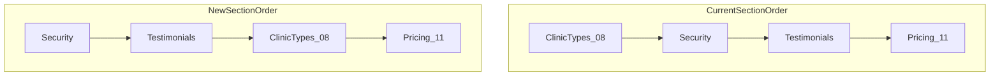

# Vetflow Homepage UI Polish

**Project:** [`D:\Vibe\Vetflow`](D:\Vibe\Vetflow) (open this folder in Cursor to implement)

**Note:** The attached auth-redirect plan is already implemented in `contentms`. This plan covers your screenshot feedback for the Phoenix OS marketing site.

---

## 1. Move `08 / CLINIC TYPES` before Pricing

**File:** [`components/home/PhoenixHomePage.tsx`](D:\Vibe\Vetflow\components\home\PhoenixHomePage.tsx)

Current order (excerpt):

```
FeatureToolbox → ClinicTypes → SecuritySection → Testimonials → PricingPreview
```

**New order:**

```
FeatureToolbox → SecuritySection → Testimonials → ClinicTypes → PricingPreview
```

Clinic Types lands immediately above Pricing as requested. Optional: update eyebrow labels in section headers if you want strict numeric flow (`08` before `11 / PRICING`) — numbers already match.

---

## 2. Photo 1 — Remove outer `phx-panel` box (your choice)

**File:** [`components/home/AnimatedOSDemo.tsx`](D:\Vibe\Vetflow\components\home\AnimatedOSDemo.tsx)

Remove the inner `phx-panel p-3 sm:p-4 phx-glow` wrapper around `DashboardPreviewStack`. Keep:

- `rounded-2xl overflow-hidden` container
- `BorderBeam` accent
- Per-slide card border in [`DashboardPreviewStack.tsx`](D:\Vibe\Vetflow\components\home\DashboardPreviewStack.tsx)

```tsx
// Before
<div className="phx-panel p-3 sm:p-4 phx-glow relative">
  <DashboardPreviewStack ... />
</div>

// After
<DashboardPreviewStack className="relative" ... />
```

---

## 3. Photo 2 — Verify and polish Live overview mockup

**Files:** [`LiveDashboardMockup.tsx`](D:\Vibe\Vetflow\components\home\LiveDashboardMockup.tsx), [`DashboardPreviewStack.tsx`](D:\Vibe\Vetflow\components\home\DashboardPreviewStack.tsx)

After removing the double box, apply professional polish aligned with photo 2:

- Tighten carousel card: `rounded-xl border border-white/10 shadow-xl` (no heavy double background)
- Ensure mockup fills the card without extra padding gap from removed panel
- Speed up **Patient Flow** dot animation: `duration` `5000` → `2800` ms in `LiveDashboardMockup.tsx`
- Slightly reduce carousel auto-advance: `AUTO_PLAY_MS` `5000` → `4200` in `DashboardPreviewStack.tsx` for snappier hero demo feel
- Verify KPI + schedule + flow layout at `max-w-[520px]` — no overflow/clipping on mobile

---

## 4. Photo 3 — Faster Solution carousel animation

**File:** [`components/home/SolutionCarousel.tsx`](D:\Vibe\Vetflow\components\home\SolutionCarousel.tsx)

| Constant | Current | New |
|----------|---------|-----|
| `AUTO_PLAY_MS` | 6000 | **3800** |
| Slide `transition.duration` | 0.35 | **0.22** |

Keeps pause-on-hover behavior; tabs and arrows unchanged.

---

## 5. Photo 4 — `Early-access clinic` → `Early-access member`

Replace in all testimonial surfaces:

| File | Change |
|------|--------|
| [`lib/home-data.ts`](D:\Vibe\Vetflow\lib\home-data.ts) | All 4 `TESTIMONIALS[].subtitle` values |
| [`components/home/TestimonialCard.tsx`](D:\Vibe\Vetflow\components\home\TestimonialCard.tsx) | Hardcoded footer line (line 88) |
| [`components/home/Testimonials.tsx`](D:\Vibe\Vetflow\components\home\Testimonials.tsx) | Intro copy: "Early-access **members** share..." |

`AnimatedTestimonials.tsx` reads `activeItem.subtitle` from data — no component change needed beyond data.

---

## 6. Verify and ship

```bash
cd D:\Vibe\Vetflow
npm run build
npm run lint
```

Manual check on homepage:

1. Live overview: single bordered carousel card, no extra panel shell
2. Solution Follow-up tab cycles faster
3. Testimonials show "EARLY-ACCESS MEMBER"
4. Clinic Types section appears directly above Pricing


